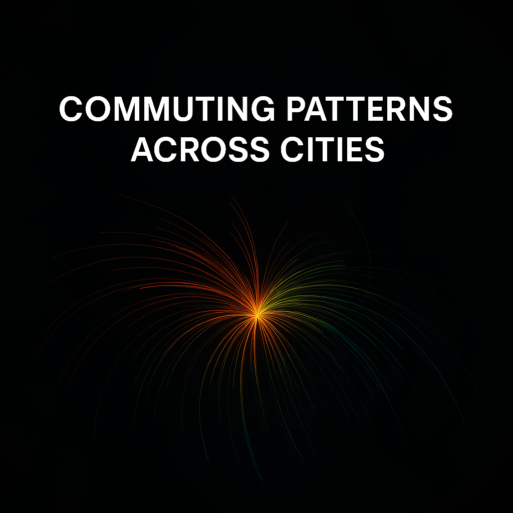

# Commuting Patterns — Interactive Maps

**Explore how people move through cities.**  
Interactive Kepler.gl maps built from open commuting datasets such as LODES, OD surveys, and GTFS feeds.

🔗 **Live site:** [https://sungyol2.github.io/Commuting_Patterns/](https://sungyol2.github.io/Commuting_Patterns/)

---

## 🌆 Maps

| City | Data Source | Description | Live Link |
|------|--------------|--------------|------------|
| **Seattle** | U.S. Census LODES8 2022 | Home → Work flow visualization (block → tract aggregation) | [Open map →](https://sungyol2.github.io/Commuting_Patterns/Seattle/) |
| **São Paulo** | OD Survey | Metropolitan commuting network visualization | *(coming soon)* |
| **Portland** | TriMet GTFS | Transit service animation | *(coming soon)* |

---

## ⚙️ Tech Stack
- **Python:** GeoPandas, Pandas, Matplotlib — data wrangling & aggregation  
- **Kepler.gl:** Interactive 3D visualization  
- **QGIS:** Geoprocessing and spatial analysis  
- **GitHub Pages:** Web hosting and version control

---

## 📂 Repository Structure
```
Commuting_Patterns/
├─ index.html # Landing page for all maps
├─ Seattle/ # Kepler export + code + data
├─ Sao_Paulo/ # (planned)
├─ Portland/ # (planned)
├─ assets/ # Preview images for social cards
└─ README.md
```

---

## 👤 Author
**Sun-Gyo Lee**  
Urban Planner · Data Analyst · Geospatial Storyteller  
📍 Seattle, WA | 🌐 [LinkedIn]((https://www.linkedin.com/in/sun-gyo/))

---

## 🗺️ License
This project is open-source under the MIT License.
